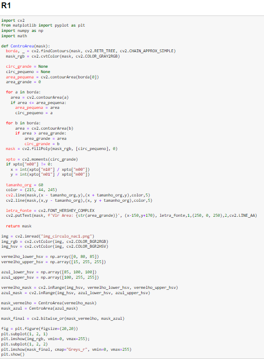
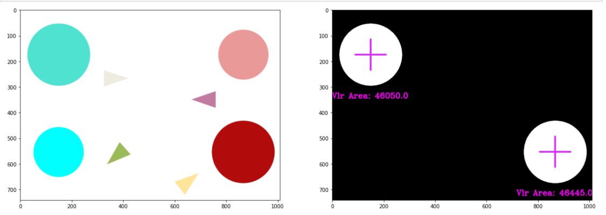
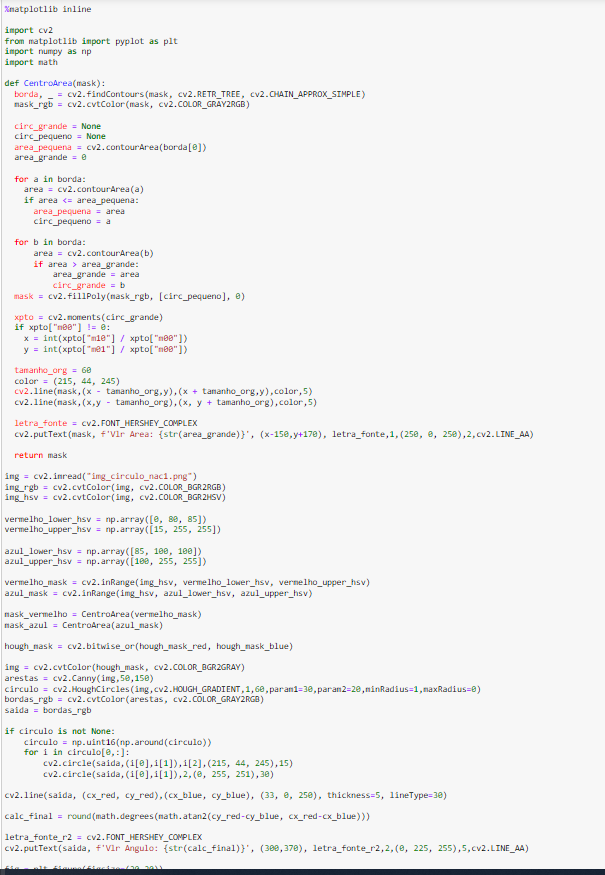
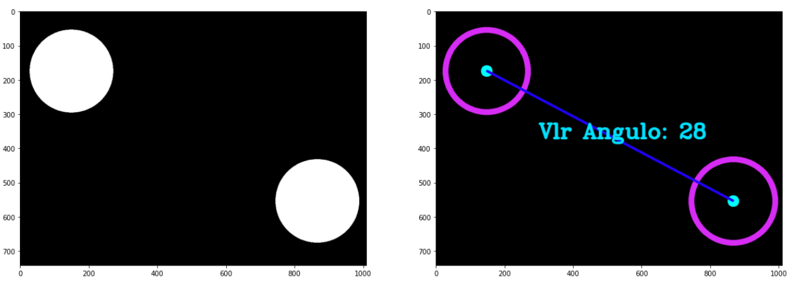

# Template para desenvolvimento e entrega de NAC

Esse é um guia simples, o grupo pode e deve modificar o template conforme necessidade. 

# NAC_Python_1

**Gustavo Gomes Da Silva Fileto / Vinicius Paes De Moura** 

**4-SIS**

**2022**

## Objetivo / descrição do Projeto

Explique de forma clara qual o objeto deste projeto, para que serve e comente as principais tecnologias utilizadas. 

O objetivo do projeto erá identificarmos os circulos que possuiam a cor azul piscina e vermelho, identificarmos a área e centro da massa dessas figuras e posteriormente, identificarmos e implementarmos uma reta que liga os dois circulos em seu centro. Utilizamos a tecnologia Jupyter Notebook com o auxilio do das documetações disponibilizadas no docs.opencv.org.

## Diagrama do projeto

Código e imagens salvas no diretorio do git.

## Como usar 

O projeto deverá ser rodado na plataforma jupyter notebook. Apontando, com a ajuda do cmd, para a pasta que deseja inicializar o projeto. Imports e metodos utilizados durante o código serão disponibilizados no workflow do projeto.

## Link de vídeo demonstração

Adicione o link para assistir ao vídeo do projeto funcionando.

[Link para o video youtube](https://youtu.be/TLdT8o-CH-E)

### Referências 

* [função def](https://hub.packtpub.com/basics-jupyter-notebook-python/)
* [findContours -](https://docs.opencv.org/2.4/modules/imgproc/doc/structural_analysis_and_shape_descriptors.html#findcontours)
* [Moments](https://gist.github.com/schwehr/4694343)
* [line](https://docs.opencv.org/2.4/modules/core/doc/drawing_functions.html?highlight=line#cv2.line)
* [init front (FONT_HERSHEY_SIMPLEX)](https://docs.opencv.org/2.4/modules/core/doc/drawing_functions.html?highlight=font_hershey_simplex)
* [bitwise_or](https://docs.opencv.org/2.4/modules/core/doc/operations_on_arrays.html?highlight=bitwise_or)
* [HoughCircles]https://docs.opencv.org/2.4/modules/imgproc/doc/feature_detection.html?highlight=houghcircles)
* [bitwise_or](https://docs.opencv.org/2.4/modules/core/doc/operations_on_arrays.html?highlight=bitwise_or)
